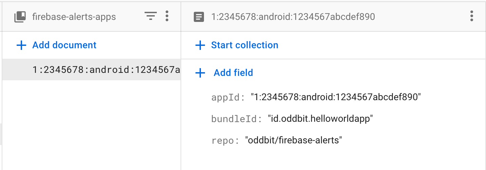

# About
Firebase extension for sending Firebase alert notifications to your team communication
platform. 

Currently supported platforms and alerts according to [roadmap](https://github.com/oddbit/firebase-alerts/issues?q=is%3Aissue+is%3Aopen+label%3Aenhancement)

| Platform    | App Distribution | Crashlytics | Performance | Billing | 
| ----------- | :--------------: | :---------: | :---------: | :-----: | 
| Google Chat | ❌  | ✅ | ❌ | ❌ |
| Slack       | ❌  | ✅ | ❌ | ❌ |
| Discord     | ❌  | ✅ | ❌ | ❌ |


# Configuring your webhooks
Read the official documentation for each of the platforms on how to configure 
webhooks.

* [Google Chat](https://developers.google.com/hangouts/chat/how-tos/webhooks)
* [Slack](https://slack.com/help/articles/115005265063-Incoming-webhooks-for-Slack)
* [Discord](https://support.discord.com/hc/en-us/articles/228383668-Intro-to-Webhooks)

There is a square Firebase icon under the [`/icons/`](./icons) folder that you 
can use for your webhook avatar. Use this permalink to the image: `https://github.com/oddbit/firebase-alerts/raw/main/icons/firebase.png`


# Installation
You can integrate the notifications with your Firebase project by forking this
repository and adjusting the [`.github/workflows/cloud-functions.yml`](./.github/workflows/cloud-functions.yml)
action file according to your project setup. 

The current workflow file requires two [Github secrets](https://docs.github.com/en/actions/security-guides/encrypted-secrets) 
in order to work.

 1. `PROJECT_ID` - Your Firebase project id
 2. `FIREBASE_SA` - A service account that will be used to deploy with (see [Service Accounts](#service-accounts))


## Service Account
Set up a Service Account to deploy with the Firebase CLI. 

1. Create a Google Service Account and download a key file (json format)
1. Base64 encode the JSON contents of the file and copy to the clipboard
1. Save this key as a [secret](https://docs.github.com/en/actions/security-guides/encrypted-secrets) in your GitHub repository. Name the secret `FIREBASE_SA` if you are using the [default action]((.github/workflows/cloud-functions.yml)) of the repo.
1. Give your Service Account sufficient roles to deploy to your project.

The service account JSON must be base64 encoded to avoid escaping errors of quotes and line breaks when 
working with the Github Secret.

Run the following command to encode and copy to the clipboard

```bash
base64 -i service-account-file.json | pbcopy
```

## Configuring webhooks
The extension require webhooks to be defined in a Firestore collection named
`firebase-alerts-webhooks`. You can declare any number of webhooks and it doesn't 
matter if you are having several webhooks for the same platform.

A webhook document require two fields
 - `language` - The language for standard buttons, titles etc 
 - `url` - The target URL of your webhook


## Configuring apps
Configure your apps with useful information in order for the extension to be 
able to provide useful actions such as quickly creating Github issues and to
be able to link directly to a Crashlytics issue.

Create one document for each of your Firebase app ids in a collection named
`firebase-alerts-apps`. Use the app id as the document id

 - `appId` - Firebase app id 
 - `bundleId` - Application bundle id (e.g. `id.oddbit.helloworldapp`)
 - `github` - Optional object for github info
     - `repo` - Repository owner and name (e.g. `oddbit/firebase-alerts`)
 


# Getting involved
If you're reading this, you're awesome! 

## Building webhook plugins
It's easy and fun to develop new webhook plugins. All you need to do is to 
declare your new plugin and create a new class that extends the abstract 
[`Webhook`](./functions/src/models/webhook.ts)

Have a look at the existing plugin(s) under [`functions/src/webhook-plugins/`](./functions/src/webhook-plugins)
to see how an implementation can look like. 

Create your new plugin alongside the existing plugins `your-new-plugin.ts`

```typescript
export class YourNewPluginWebhook extends Webhook {
  // Implements Webhook
}
```

### Registering the new plugin
There are three simple steps to register your plugin
in [`./functions/src/webhook-plugins/index.ts`](./functions/src/webhook-plugins/index.ts)

#### Step 1
Add your plugin to the enumeration

```typescript
export enum WebhookPlatform {
  GoogleChat,
  Slack,
  Discord,
  YourNewPlugin, // Add your new plugin
  Unknown,
}
```

#### Step 2
Add your webhook signature to the method `derivePlatformTypeFromUrl()` so that 
your webhooks can be recognized.

```typescript
export function derivePlatformTypeFromUrl(url: string): WebhookPlatform {
  if (url?.startsWith("https://chat.googleapis.com")) {
    return WebhookPlatform.GoogleChat;
  } else if (/* other webhook */) {
    // ...
    // Add your webhook signature below
  } else if (url?.startsWith("https://YourNewPluginWebhook.example.com")) {
    return WebhookPlatform.YourNewPlugin;
  }

  return WebhookPlatform.Unknown;
}

```
#### Step 3
Register a builder method

```typescript
const webhookPlugins: {[key: string]: WebhookBuilder} = {
  [WebhookPlatform.GoogleChat]: (webhook) => new GoogleChatWebhook(webhook),
  // ...
  // Other webhook builders 
  // ...
  [WebhookPlatform.YourNewPlugin]: (webhook) => new YourNewPluginWebhook(webhook),
};
```

